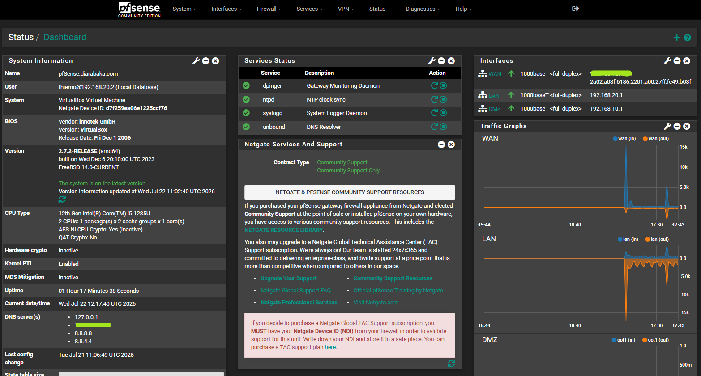
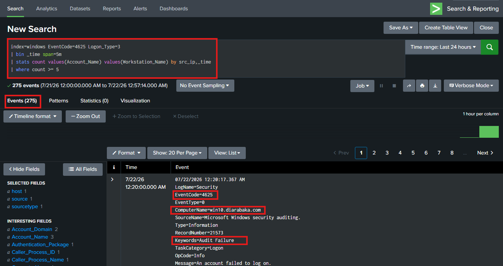
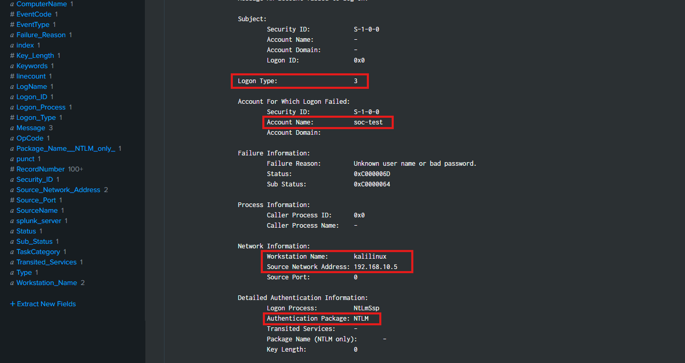
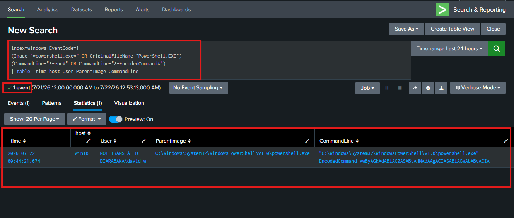
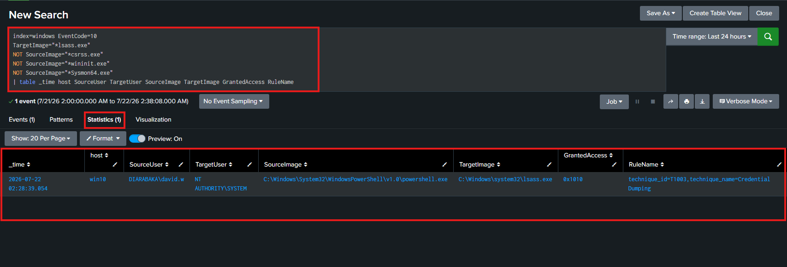
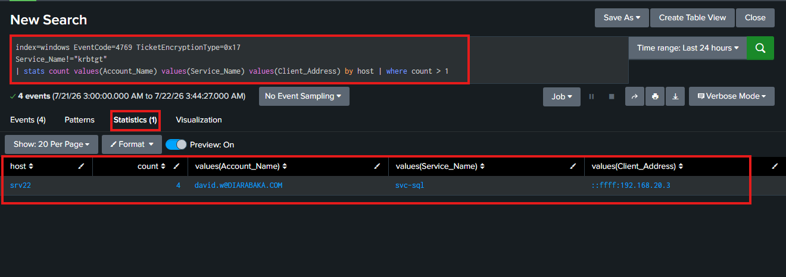
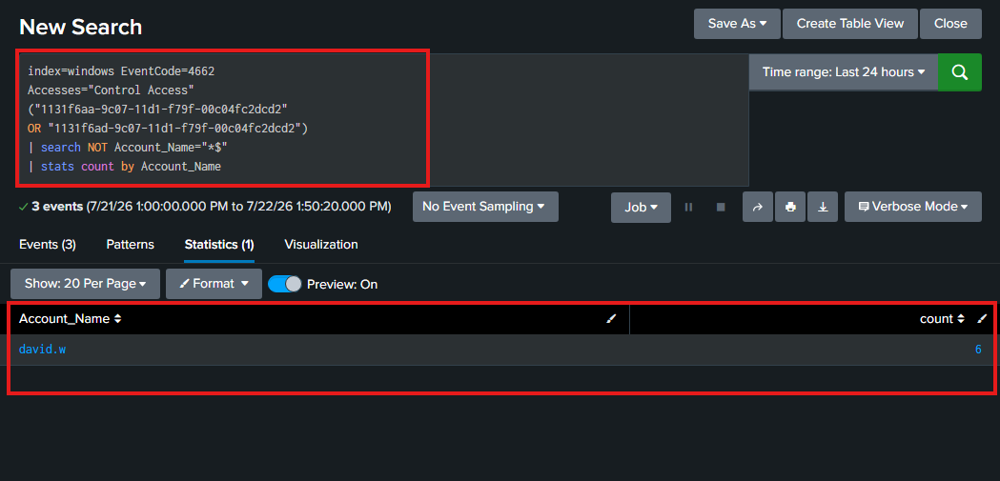
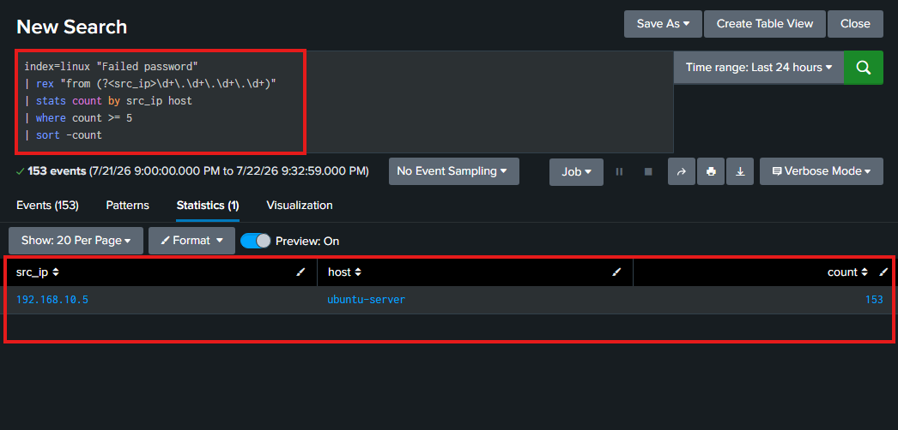
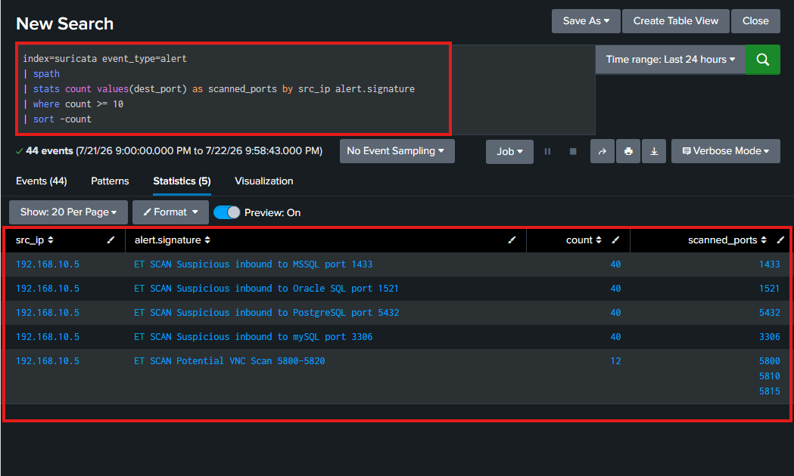
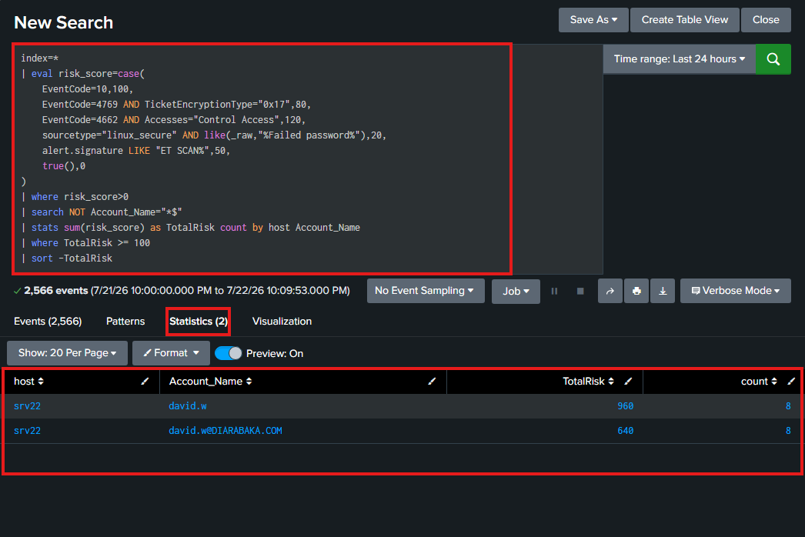

# Enterprise SOC Monitoring & Threat Detection Platform

Enterprise SOC lab implementing SIEM monitoring, threat detection, threat hunting, and automated response using Splunk Enterprise, Sysmon, Suricata, auditd, pfSense, and Windows/Linux systems.


---

## Project Overview

**Role:** SOC Analyst  
**Environment:** Hybrid Enterprise Network  
**Focus:** Detection Engineering / Threat Hunting / Incident Response

Implemented:

- Centralized log collection
- SIEM correlation
- MITRE ATT&CK mapped detections
- Risk-based alerting
- Automated containment workflow

---

## SOC Architecture

Technologies:

- Splunk Enterprise (SIEM)
- Universal Forwarder
- Sysmon
- Windows Event Logs
- auditd
- Suricata IDS
- pfSense Firewall




---

# Lab Environment

## Enterprise LAN (192.168.20.0/24)

| System         | IP Address   | Role                      |
| -------------- | ------------ | ------------------------- |
| pfSense        | 192.168.20.1 | Firewall                  |
| Windows Server | 192.168.20.2 | Active Directory + Sysmon |
| Windows Client | 192.168.20.3 | Endpoint Monitoring       |
| Ubuntu Server  | 192.168.20.4 | Linux Logs + auditd       |
| Splunk         | 192.168.20.5 | SIEM Platform             |

---

## Attacker Network (192.168.10.0/24)

| System     | IP Address   | Role              |
| ---------- | ------------ | ----------------- |
| Kali Linux | 192.168.10.5 | Attack Simulation |

---

# Data Sources

## Windows

Collected:

- Security Events
- Sysmon Telemetry
- Authentication Logs
- Process Creation

Monitored:

- 4624 - Successful Logon
- 4625 - Failed Logon
- 4662 - Directory Access
- 4769 - Kerberos
- Sysmon 1 - Process Creation
- Sysmon 10 - Process Access

---

## Linux

Collected:

- SSH authentication
- auditd events
- User activity
- Privilege escalation events

---

## Network

Collected:

- pfSense firewall logs
- Suricata IDS alerts
- Network anomalies

---

# Detection Engineering

MITRE ATT&CK mapped detections:

| Detection                  | Technique |
| -------------------------- | --------- |
| Authentication Brute Force | T1110     |
| Encoded PowerShell         | T1059.001 |
| LSASS Credential Dumping   | T1003.001 |
| Kerberoasting              | T1558.003 |
| DCSync                     | T1003.006 |
| SSH Brute Force            | T1110     |
| Network Port Scan          | T1046     |
| Scheduled Task Persistence | T1053     |

---

# Threat Hunting

## Authentication Brute Force Detection

MITRE ATT&CK:
T1110 - Brute Force

Simulation:
Hydra authentication attempts from Kali Linux

Evidence:

- Windows Security Event ID 4625
- Logon Type 3 (Network)
- Source IP identified
- Account targeted: soc-test

Detection:




---

## Encoded PowerShell Detection

MITRE ATT&CK:
T1059.001 - PowerShell

Detection:



---

## LSASS Credential Dumping

### MITRE ATT&CK

- Technique: T1003.001
- Tactic: Credential Access
- Detection Source: Sysmon Event ID 10 (Process Access)

### Detection Logic

Detects suspicious processes accessing the LSASS memory space.



---

## Kerberoasting

### MITRE ATT&CK

- Technique: T1558.003
- Tactic: Credential Access
- Detection Source: Windows Security Event ID 4769 (Kerberos Service Ticket)

### Detection Logic

Detects Kerberos service ticket requests using RC4 encryption, commonly associated with Kerberoasting attacks.



---

## DCSync Detection

Detects suspicious Active Directory replication requests that may indicate a DCSync attack.



---

## SSH Brute Force

Detect repeated failed SSH authentication attempts from a single source.

Detection logic:

- Multiple failed SSH logins
- Same source IP
- Enumeration of several usernames
- Threshold-based alerting



---

## Port Scan Detection

Detect network reconnaissance activity using Suricata IDS alerts.

Detection logic:

- Identify repeated IDS scan alerts
- Correlate source IP with targeted services
- Detect reconnaissance activity against multiple network services

Detection:



---

## Risk-Based Alerting

Implemented:

- Risk scoring
- Multi-source event correlation
- Alert prioritization
- False positive reduction

Detection logic:

| Attack                   | Source                    | Risk Score |
| ------------------------ | ------------------------- | ---------: |
| LSASS Credential Dumping | Sysmon Event ID 10        |        100 |
| Kerberoasting            | Windows Event ID 4769 RC4 |         80 |
| DCSync                   | Windows Event ID 4662     |        120 |
| SSH Brute Force          | Linux auth logs           |         20 |
| Port Scan                | Suricata IDS              |         50 |



---

# Automated Response

Implemented automated containment workflow integrating SIEM detection with firewall enforcement.

## Response Workflow

1. Detect malicious activity through SIEM correlation
2. Calculate risk score and prioritize alert
3. Extract attacker source IP
4. Execute containment action
5. Validate firewall enforcement and collect evidence

## Response Actions

- Firewall blocking through pfSense
- Threat containment
- Incident investigation
- Evidence collection
- Post-containment validation

Example containment action: `easyrule block DMZ <source_ip>`


---

# Incident Response Workflow

```
Detection
    |
Correlation
    |
Risk Scoring
    |
Alert Generation
    |
Containment
    |
Investigation
    |
Incident Closure
```

---

# Skills Demonstrated

- Splunk Enterprise Administration
- SIEM Engineering
- Detection Engineering
- Threat Hunting
- MITRE ATT&CK Mapping
- Windows Security Monitoring
- Linux Security Monitoring
- Network Security Monitoring
- Incident Response
- Security Automation

---

# Challenges & Resolutions

| Challenge                   | Resolution                          |
| --------------------------- | ----------------------------------- |
| Sysmon events missing       | Fixed forwarding and firewall rules |
| Suricata performance issues | Tuned configuration                 |
| Splunk ingestion limits     | Optimized indexing                  |
| Firewall automation failure | Updated integration script          |

---

# References

- [Splunk Documentation](https://docs.splunk.com/)  
  SIEM administration, SPL development, dashboards, and correlation searches.

- [MITRE ATT&CK Framework](https://attack.mitre.org/)  
  Adversary tactics and techniques mapping for detection engineering.

- [Sysmon Documentation](https://learn.microsoft.com/en-us/sysinternals/downloads/sysmon)  
  Windows telemetry collection and endpoint monitoring.

- [Microsoft Windows Security Auditing Documentation](https://learn.microsoft.com/en-us/windows/security/threat-protection/auditing/basic-audit-policy-recommendations)  
  Security event analysis (4625, 4662, 4769, etc.).

- [Suricata Documentation](https://docs.suricata.io/)  
  IDS/IPS configuration, network threat detection, and alert management.

- [Atomic Red Team](https://github.com/redcanaryco/atomic-red-team)  
  Adversary simulation and detection validation using MITRE ATT&CK techniques.

- [Crowbar](https://github.com/galkan/crowbar)  
  Brute-force testing tool used for security detection validation.

- [pfSense Documentation](https://docs.netgate.com/pfsense/en/latest/)  
  Firewall administration and automated containment actions.

- [DSInternals PowerShell Module](https://github.com/MichaelGrafnetter/DSInternals)  
  Active Directory security testing and replication analysis.

- [Mimikatz](https://github.com/gentilkiwi/mimikatz)  
  Credential security research and Active Directory attack simulation.
